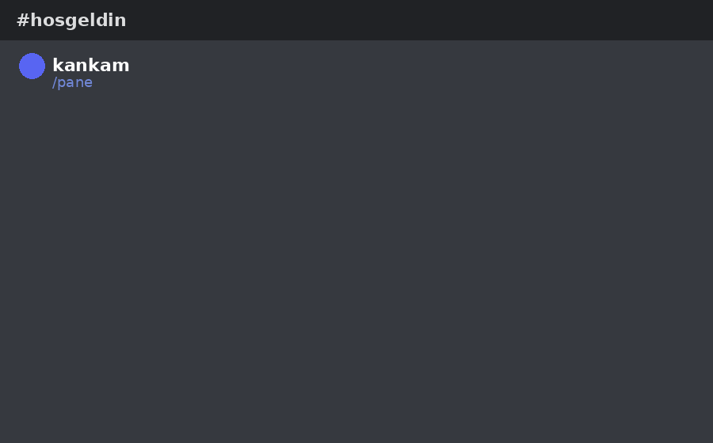
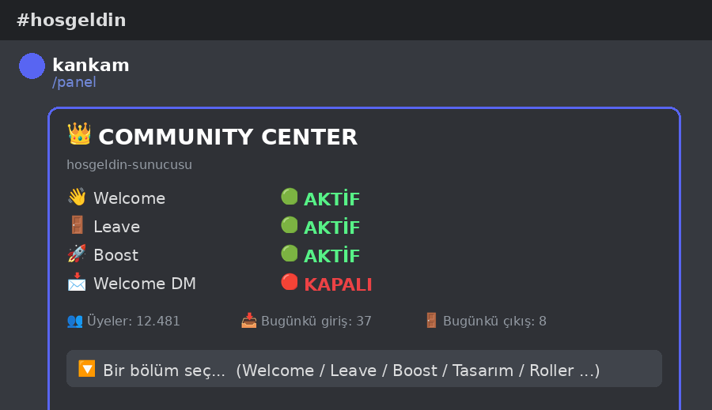
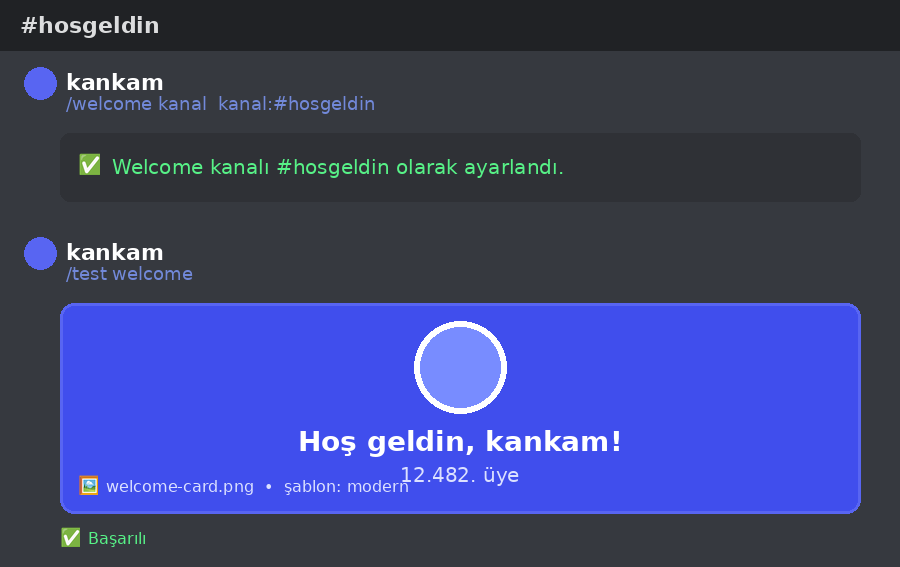
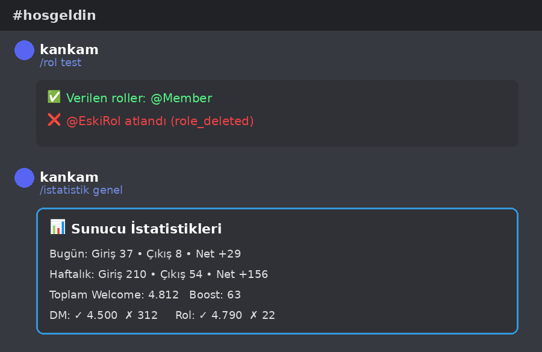

<div align="center">

# 👑 Discord Welcome & Community Control Center

### Dashboard'suz, %100 Discord içi, Components V2 tabanlı Community Yönetim Sistemi


**Sıfırdan yazılmış • `.env` yok • Web panel yok • Sahte özellik yok**

</div>

---

## 🎬 Önizleme

<div align="center">

### `/panel` komutu ile açılan Components V2 kontrol merkezi



</div>

---

## 🖼️ Komut Kullanım Örnekleri

<table>
<tr>
<td align="center" width="33%">
<b>1️⃣ Ana Kontrol Merkezi</b><br><sub><code>/panel</code></sub>
</td>
<td align="center" width="33%">
<b>2️⃣ Kanal Ayarla + Test Et</b><br><sub><code>/welcome kanal</code> → <code>/test welcome</code></sub>
</td>
<td align="center" width="33%">
<b>3️⃣ Rol Testi + İstatistik</b><br><sub><code>/rol test</code> → <code>/istatistik genel</code></sub>
</td>
</tr>
<tr>
<td></td>
<td></td>
<td></td>
</tr>
</table>

> ℹ️ Yukarıdaki görseller, panelin ve komutların **gerçek çıktı formatını** birebir yansıtan
> tasarım mockup'larıdır (Discord'un kendi arayüz varlıkları kullanılmamıştır). Botu kendi
> sunucunda çalıştırdığında göreceğin gerçek Components V2 arayüzü bu mockup'lardaki
> yapının aynısıdır.

---

## ✨ Öne Çıkan Özellikler

<table>
<tr>
<td width="50%" valign="top">

### 🧠 Çekirdek Mimari
- ✅ %100 JavaScript
- ✅ `ayarlar.json` tabanlı config, `.env`
- ✅ Gerçek Discord **Components V2** API'si
- ✅ Guild-bazlı, tamamen bağımsız veri katmanı
- ✅ Cache + atomic yazım (`data/guilds/<guildId>.json`)
- ✅ Crash protection (`unhandledRejection` / `uncaughtException`)

</td>
<td width="50%" valign="top">

### 👋 Welcome / Leave / Boost
- ✅ Embed + gerçek render edilen görsel kart (5 şablon)
- ✅ Merkezi **Placeholder Engine** (17 değişken)
- ✅ Otomatik rol (insan/bot ayrı, hiyerarşi kontrollü)
- ✅ Welcome DM (kapalıysa sessizce atlar, çökmez)
- ✅ Bağımsız Leave & Boost motorları

</td>
</tr>
<tr>
<td width="50%" valign="top">

### 🛡️ Güvenlik & Kalite
- ✅ Panel sahiplik kontrolü (başkası tıklayamaz)
- ✅ Aksiyon bazlı yetki kontrolü (`Manage Roles`, vb.)
- ✅ Rate limit / anti-spam (buton + komut)
- ✅ Audit log (`logs/audit.log` + Discord içi görünüm)
- ✅ Config validator (silinen kanal/rol tespiti)

</td>
<td width="50%" valign="top">

### 💾 Yönetim Araçları
- ✅ Yedekle / geri yükle / sil (`/yedek`)
- ✅ JSON dışa/içe aktarma + şema doğrulama
- ✅ Merkezi test merkezi (`/test`, panelden de erişilebilir)
- ✅ Analitik: günlük/haftalık/aylık giriş-çıkış, net büyüme
- ✅ `/sistem-kontrol`, `/status`, `/guvenlik` sağlık komutları

</td>
</tr>
</table>

---

## 🚀 Kurulum

```bash
git clone <repo-url>
cd discord-welcome-bot
npm install
```

```bash
cp ayarlar.example.json ayarlar.json
```

`ayarlar.json` dosyasını doldur:

```json
{
  "token": "BOT_TOKEN",
  "clientId": "CLIENT_ID",
  "guildId": "TEST_GUILD_ID",
  "ownerIds": ["SENIN_DISCORD_ID_IN"]
}
```

```bash
npm run deploy   # slash komutlarını Discord'a kaydeder
npm start        # botu başlatır
```

> 🔎 `npm test` ile config/veritabanı/placeholder motorunun kurulumdan hemen sonra
> doğru çalıştığını (Discord'a bağlanmadan) doğrulayabilirsin.

### Gerekli Discord İzinleri & Intent'ler

| Gereksinim | Neden |
|---|---|
| `Manage Roles` | Otomatik rol verme |
| `Manage Channels` | Kanal seçim menülerini okuma |
| `Send Messages`, `Embed Links`, `Attach Files` | Welcome/Leave/Boost mesajları |
| **Server Members Intent** *(Developer Portal)* | `guildMemberAdd` / `guildMemberRemove` event'leri |

---

## 🗂️ Komut Haritası

| Komut | Açıklama |
|---|---|
| `/panel` | 👑 Ana Components V2 kontrol merkezi |
| `/welcome` | kur • ac • kapat • durum • kanal • sablon • gorsel • dm • rol • test • degiskenler • sifirla |
| `/leave` | ac • kapat • durum • kanal • sablon • gorsel • test • sifirla |
| `/boost` | ac • kapat • durum • kanal • test • sifirla |
| `/rol` | ekle • kaldir • liste • test • sifirla |
| `/tasarim` | goster • renk • sekil |
| `/mesaj` | onizle • degiskenler |
| `/test` | welcome • leave • boost • dm • rol • gorsel • degisken • izin • sistem |
| `/istatistik` | genel • buyume |
| `/ayarlar` | goruntule • disaaktar • iceaktar • sifirla |
| `/yedek` | olustur • liste • geriyukle • sil |
| `/guvenlik` | durum • izinler • kontrol |
| `/sistem-kontrol`, `/status`, `/yardim` | Sağlık, uptime ve interaktif yardım |

**Panel ↔ Komut senkron çalışır:** panelden değiştirdiğin ayar komutta, komuttan
değiştirdiğin ayar panelde anında görünür — aynı guild veritabanı katmanını paylaşırlar.

---

## 🧩 Görsel Kart Şablonları

`@napi-rs/canvas` ile **gerçek olarak render edilen** 5 şablon:

`classic` · `modern` · `minimal` · `dark` · `neon`

Her biri farklı bir kompozisyon/renk paleti çizer — sahte placeholder görsel yoktur.
Yeni şablon eklemek için `src/services/imageService.js` içindeki `TEMPLATE_RENDERERS`
nesnesine aynı imzalı bir fonksiyon eklemen yeterli; panel ve komutlar otomatik
olarak yeni şablonu listeler.

---

## 🧱 Proje Mimarisi

```
discord-welcome-bot/
├── src/
│   ├── commands/       → 15 slash komutu
│   ├── components/     → Components V2 panel & alt paneller
│   ├── modals/         → mesaj/renk/import modalları
│   ├── services/       → welcome, leave, boost, rol, dm, görsel, analitik, yedek...
│   ├── database/       → guild-bazlı JSON veri katmanı
│   ├── events/         → ready, interactionCreate, guildMember(Add/Remove/Update)
│   ├── core/           → client, command/event loader, deploy script
│   ├── errors/         → crash protection
│   └── logger/         → dosya + konsol loglama
├── data/
│   ├── guilds/         → her sunucunun bağımsız ayar dosyası
│   └── backups/        → yedekler
├── logs/                → app.log, error.log, discord.log, audit.log
├── ayarlar.json / .example.json
└── README.md
```

---

<div align="center">

Power By WnersDev

</div>
